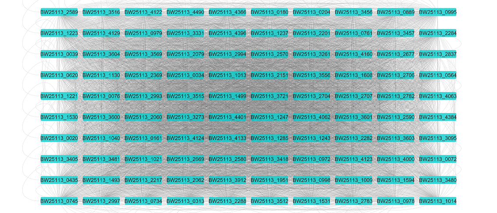
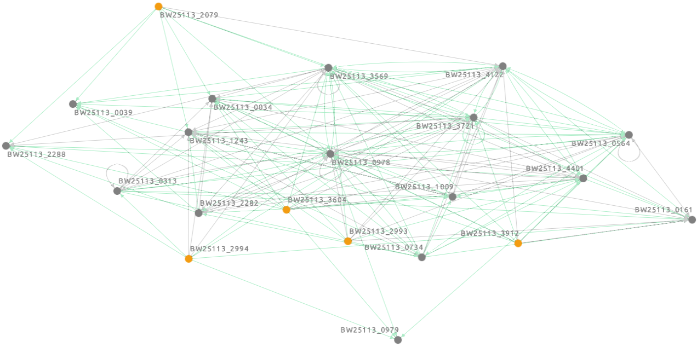

Examples
----------
The example section is divided into two sections.
In the first on we infer subnetworks using *in silico* dataset with the aim to get familiar with Augusta.
In the second section we infer networks using real organism´s dataset.
All input data are available on GitHub in the `"data" directory <https://github.com/JanaMus/Augusta/tree/master/data>`_.
Furthermore, in each section is tutorial how to download the inputs.

Test data
^^^^^^^^^^^^
Test data are made by *in silico* dataset of bacterium´s *Escherichia coli* selected genes
provided by the `DREAM4 challenge <https://www.synapse.org/#!Synapse:syn3049712/wiki/74628>`_.

Input files
"""""""""""""

* **count table** file

We will use the file "insilico_size100_1_timeseries.csv" from the
`DREAM4 challenge. <https://www.synapse.org/#!Synapse:syn3049712/wiki/74628>`_.
We modified the file for our needs by swapping the matrix so that the genes are in the first column and times in the first row.
We also rewrote the gene names according to the official gene names of the organism in order to match particular genes with information available in GenBank file.
The modified file is available on GitHub in the "data" directory as `"Ecoli_DREAM4.csv" <https://github.com/JanaMus/Augusta/blob/master/data/Ecoli_DREAM4.csv>`_.

* **GenBank** file

We will use *Escherichia coli* BW25113 available from NCBI Nucleotide database under the accession `CP009273 <https://www.ncbi.nlm.nih.gov/nuccore/CP009273.1/>`_.
The GenBank file can be downloaded in the GenBank full format. Otherwise,
it is also available on GitHub in the "data" directory as `"Ecoli.gb" <https://github.com/JanaMus/Augusta/blob/master/data/Ecoli.gb>`_.

Usage example
"""""""""""""
Below is provided an example of the functions for generating GRN and for converting GRN to BN. See :ref:`Usage` for further available functions.

*Note: input files must be in the current directory or full path must be provided.*

Generate GRN:

.. code-block:: python

   >>> GRN = Augusta.RNASeq_to_GRN(count_table_input = 'Ecoli_DREAM4.csv', promoter_length = 1000, genbank_file_input = 'Ecoli.gb', normalization_type = 'TPM')

   Count table uploaded.
   GenBank uploaded.
   Count table normalization done.
   Mutual information computation...
   Mutual information computation done.
   Motifs search...
   Motifs search done.
   Synonym organism names search...
   Synonym genes names search...
   Synonym names search done.
   No data searched in interaction databases.
   GRN stored as "GRN.csv".

The computation should be done in several minutes, depending on the specific machine.

Convert generated GRN to BN:

.. code-block:: python

   >>> Augusta.GRN_to_BN(GRN_input = GRN, promoter_length = 1000, genbank_file_input = 'Ecoli.gb', add_dbs_info = 1)

   GRN uploaded.
   GenBank uploaded.
   Synonym organism names search...
   Synonym genes names search...
   Synonym names search done.
   No data searched in interaction databases.
   GRN stored as "GRN.csv".
   Cell Collective database search done.
   Boolean network stored as "BN.sbml".
   

The computation should be done in several minutes, depending on the specific machine.

Output files
"""""""""""""
The files are stored in the generated "output" directory.

* transcription motifs

 * all motifs discovered in the genome assigned to their transcription factor
 * Stockholm file format
 * "discovered_motifs.sto"
 * available on GitHub in the "data/output" directory as `"Ecoli_discovered_motifs.sto" <https://github.com/JanaMus/Augusta/blob/master/data/output/Ecoli_discovered_motifs.sto>`_

First transcription factor´s motifs in the file (transcription factor is BW25113_0564; discovered motifs are in the second column):

.. code-block:: python

   # STOCKHOLM 1.0
   #=GF ID   BW25113_0564
   BW25113_0995_10	CCCGCCAGC
   BW25113_0995_5	GCGGCACGC
   BW25113_0995_9	CCCGCCATC
   BW25113_0995_7	CCAGCCCTC
   BW25113_0995_4	GCGGCAGGC
   BW25113_0995_11	CCGGGGAGC
   BW25113_0995_12	GGAGCACAC
   BW25113_0995_13	CGGGTCCAC
   BW25113_0995_3	TCCGTGCGC
   BW25113_0995_2	GGAGTGCGC
   BW25113_0995_6	TGGGCCAGG
   BW25113_0995_1	TAAGCAAGC
   BW25113_0995_8	GGCTGAAAC
   //

* Gene Regulatory Network

 * adjancency matrix in CSV file format
 * "GRN.csv"
 * available on GitHub in the "data/output" directory as `"Ecoli_GRN.csv" <https://github.com/JanaMus/Augusta/blob/master/data/output/Ecoli_GRN.csv>`_.

GRN visualized in `Cytoscape software: <https://cytoscape.org/>`_

* Boolean Network

 * network in SBML-qual file format
 * "BN.sbml"
 * available on GitHub in the "data/output" directory as `"Ecoli_BN.sbml" <https://github.com/JanaMus/Augusta/blob/master/data/output/Ecoli_BN.sbml>`_.

BN (selected genes) visualized in `Cell Collective platform: <https://research.cellcollective.org/?dashboard=true#/>`_

Real data
^^^^^^^^^^^^
Real data are made by dataset of *Clostridium beijerinckii* NRL B-598 bacterium whole genome.

Input files
"""""""""""""

* **count table** file

We will use the file we processed from the RNA-Seq dataset (available from the NCBI Sequence Read Archive (SRA) under the accession `SRP033480 <https://trace.ncbi.nlm.nih.gov/Traces/index.html?view=study&acc=SRP033480>`_; replicates B1 - B6).
The processed count table file is available on GitHub in the "data" directory as `"Cbeijerinckii.csv" <https://github.com/JanaMus/Augusta/blob/master/data/Cbeijerinckii.csv>`_.

* **GenBank** file

We will use *C. beijerinckii* NRL B-598 genome available from NCBI Nucleotide database under the accession `CP011966.3 <https://www.ncbi.nlm.nih.gov/nuccore/CP011966.3>`_.
The GenBank file can be downloaded in the GenBank full format. Otherwise,
it is also available on GitHub in the "data" directory as `"Cbeijerinckii.gb" <https://github.com/JanaMus/Augusta/blob/master/data/Cbeijerinckii.gb>`_.

Usage example
"""""""""""""
Below is provided an example of the main function for generating GRN and BN. See :ref:`Usage` for further available functions.

*Note: input files must be in the current directory or full path must be provided.*

.. code-block:: python

   >>> Augusta.RNASeq_to_SBML(count_table_input = 'Cbeijerinckii.csv', promoter_length = 1000, genbank_file_input = 'Cbeijerinckii.gb', normalization_type = 'TPM')

   Count table uploaded.
   GenBank uploaded.
   Count table normalization done.
   Mutual information computation...
   Mutual information computation done.
   Motifs search...
   Motifs search done.
   Synonym organism names search...
   Synonym genes names search...
   Synonym names search done.
   No data searched in interaction databases.
   GRN stored as "GRN.csv".
   Cell Collective database search done.
   Boolean network stored as "BN.sbml".

The computation should be done in approximately two days, depending on the specific machine.

Output files
"""""""""""""
The files are stored in the generated "output" directory.

* transcription motifs as "discovered_motifs.sto"

* Gene Regulatory Network as "GRN.csv"

* Boolean Network as "BN.sbml"

