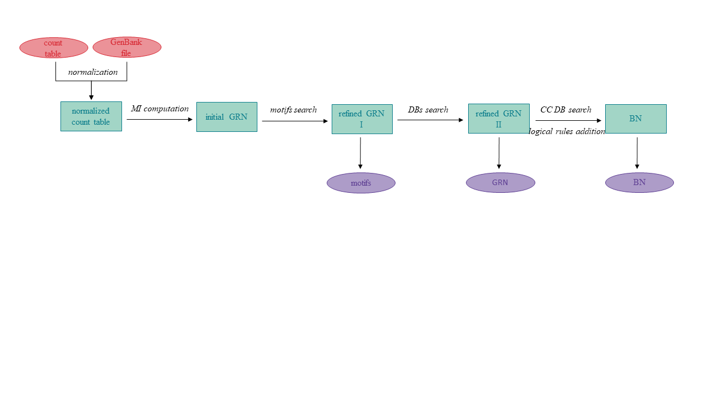

.. Augusta documentation master file, created by
   sphinx-quickstart.

Welcome to Augusta's documentation!
===================================

Augusta is a Python package for inferring Gene Regulatory Networks (GRNs) and Boolean Networks (BNs)
by processing high-throughput gene expression data (RNA-Seq).

The package infers and refines networks in a unique way.
The first estimation of a GRN is inferred from the expression dataset.
The network is further refined in two ways:
I) by predicting transcription factor binding motifs in promoters of co-regulated genes,
II) by incorporating interactions obtained from expert-validated databases.
In the next step, the GRN is transformed into a BN by adding logical rules to particular edges
primarily obtained from the Cell Collective database.
Information from the databases is only used if the data matches the organism under study,
ensuring that inaccurate information is not incorporated.

Contents
--------
.. toctree::
   Installation
   User guide
   Examples
   :maxdepth: 2

